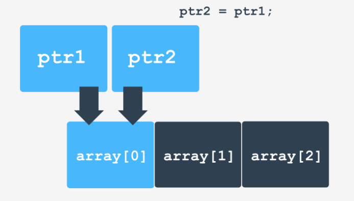

# Contenido del módulo
* [Punteros](#punteros---las-bases-absolutas)
* [Punteros vs Vectores](#punteros-vs-vectores-similutudes-y-diferencias)
* [Funciones](#funciones)
* [Parámetros por defecto](#parámetros-por-defecto)
* [Funciones en una línea](#funciones-en-una-línea)
* [Sobrecarga de funciones](#sobrecarga-de-funciones)
* [Ordenando vectores](#ordenando-vectores)
* [Memory on demand](#memory-on-demand)

# Punteros - las bases absolutas
Los tipos de datos que hemos venido usando estan muy relacionados al procesamiento de datos de la computadora, pero reflejan plenamente nuestras ideas e intuiciones. Por ejemplo, usamos *floats* todos los días de nuestras vidas cuando pagamos por algo e *ints* cuando contamos algo. Los punteros no tienen una analogía simple y obvia para nuestra vida diaria y sus valores son ilegibles para humanos y completamente inutiles. Las computadoras, sin embargo, pueden hacer un gran uso de los punteros, dando a los desarrolladores opciones potentes cuando diseñamos algoritmos y estructuras de datos.

Hasta ahora, nos ha interesado saber qué valor se almacena en la variable. A partir de ahora, también nos va a interesar saber dónde se almacena ese valor.

Este rasgo o atributo de los datos es usualmente llamado dirección o **address**.

Algunas diferencias importantes son:
* El **valor** de la variable es lo que la variable almacena
* La **dirección** de la variable es información sobre donde esta variable está ubicada

Los punteros son usados para almacenar informacion sobre la ubicacion de cualquier otro dato. Podemos decir que los punteros son como un **código postal**. No dicen nada sobre la ubicación en si, pero nos muestran claramente como llegar a ella.

## El primer puntero
Comenzaremos con una declaración simple y una operación igualmente de sencilla. Ya al momento de la declaración de la variable podemos ver la diferencia con un tipo de dato regular:
```cpp
int *p;
```

Usamos el asterisco `*` de una forma completamente nueva. Esta declaración configura una variable llamada `p`. Esta no es un *int* - el asterisco significa que `p` es un **puntero** y será usado para almacenar información sobre la ubicacion de un dato de tipo *int*. Los punteros son siempre usados para apuntar a un dato de un tipo específico referido en la declaración. El lenguaje C++ podría usar los denominados **punteros amorfos** (amorphus pointers) también, que pueden ser usados para apuntar a cualquier tipo de dato.

Cual es el tipo de dato de `p`? Hay algunas respuestas, identicas en significado, pero considerablemente diferentes. Primero, podemos decir que `p` es una variable de tipo *"puntero a int"*. Como segundo punto, sería lo siguiente: *p es una variable de tipo int*, donde `*` se lee simplemente como 'asterisco'"*.

## ¿Cómo asignamos un valor a un puntero?
Podemos asignar un valor a un puntero? Por supuesto, en el mismo modo en que asignamos cualquier valor a cualquier otra variable: usando el operador `=`. Una pregunta más importante es qué valores estamos habilitados a asignar a los punteros?

Usar un literal no es una opción. El compilador no nos permitirá escribir algo como esto, ya que primeramente, la sintaxis del lenguaje C++ no lo permite y segundo, si sabemos lo que está almacenado en la memoria del ordenador en la dirección `148324`, entonces eres un clarividente y la programación de ordenadores es una pérdida de tiempo:
```cpp	
p = 148324;
```

Hay una excepción distintiva. Podemos asignar el valor **cero** a la variable puntero. Al hacer esto, el compilador no hace ninguna pregunta.
```cpp
p = 0;
```

Un puntero al que se le asigna el valor de cero es llamado **null pointer** (puntero nulo). Este no apunta a nada. Es como un código postal con todas las escrituras eliminadas, todavía existe, pero sin propósito para el emisor. A pesar de las apariencias, este puntero puede ser muy útil e incluso necesario en algunos casos.

Debido al hecho de que asignar un valor de cero a una variable puntero puede causar malentendidos y errores (puede confundirse al puntero con un *int*), hay un acuerdo no escrito para que los desarrolladores eviten asignar punteros nulos. En su lugar, deben seguir la siguiente convención:
```cpp
p = nullptr;
```
El símbolo `nullptr` es actualmente la encarnacion de un puntero vacío (null). Este se ve como una variable pero no podemos modificar su valor por lo que puede denominarse **constante**.

No olvidemos que `nullptr` debe ser asignado solo a punteros. El compilador es muy estricto con esto.

> **TIME MACHINE**: Los antiguos estándares de C++ utilizaban una forma diferente (derivada del lenguaje C) de anotar los punteros nulos - se hacía mediante una palabra (en realidad una macro, es decir, un símbolo sustituido implícitamente por el compilador a un entero cero) `NULL`. Puedes encontrar rastros de esta práctica en código C++ antiguo - ¡no imites esta manera! Hay una advertencia más: usar el símbolo `NULL` requiere incluir el archivo de cabecera llamado `cstring`, o cualquier otro archivo de cabecera que incluya el propio `cstring` (uno de ellos es `iostream`).

Como asignamos entonces algun valor significativo diferente a `nullptr` a una variable puntero? Debemos asignar al puntero un valor que **apunte a cualquier variable ya existente**. Para hacer esto, necesitamos del operador `&`, llamado **operador de referencia**. Este es un operador prefijo unario. Este operador simplemente busca la dirección de su argumento. Veamos la sentencia:
```cpp
p = &i;
```

Luego de completar la asignación, la variable `p` apuntará al lugar donde la variable `i` es almacenada en memoria. Esto puede verse en la siguiente figura:


Si asignamos `nullptr` al puntero, este no apuntara a ninguna variable. Se dice que el puntero está conectado a tierra (**grounded**).

Qué podemos hacer con un puntero que no es null y apunta a una variable? Podemos *desreferenciarlo* (dereference).

Dereferenciar es una operación por la cual la variable puntero se vuelve un sinónimo del valor al que apunta.

Veamos como podemos declarar una variable de tipo `int` (`ivar`) y una variable de tipo `int *` (`ptr`):
```cpp
int ivar, *ptr;
```
Ahora asignamos un valor de 2 a la variable `ivar`:
```cpp
ivar = 2;
```

Ahora hacemos que el puntero `ptr` apunte a la variable `ivar`:
```cpp
ptr = &ivar;
```
Como obtenemos un valor apuntado por el puntero? Usamos el operador `*`, pero de una forma completamente diferente - como **dereferencer**.

Si colocamos un asterisco frente a un puntero, **obtenemos el valor que está almacenado en al ubicación apuntada por el puntero**.
```cpp
*ptr
```

La siguiente invocación mostrará `2` en la pantalla, ya que el valor desreferenciado de `ptr` es enviadoa `cout`:
```cpp
cout << *ptr;
```

Si escribimos una sentencia como la siguiente:
```cpp
*ptr = 4;
```
no cambiaremos el valor del puntero. En su lugar cambiaremos el valor apuntador por el puntero. Esta es una diferencia importante.

No olvidemos que si declaramos un puntero del siguiente podo:
```cpp
ANY_TIPE *pointer;
```
Significa que:
* El `pointer` es de tipo `ANY_TYPE*`
* La expresión `*` del puntero es de tipo `ANY_TYPE`

Además, no olvidemos que dereferenciar punteros nullptr está estrictamente prohibido y conduce a graves problemas muy rápidamente.

## Operador `sizeof`
El operador `sizeof` espera que su argumento sea un literal, variable, expresión encerrada entre parentesis o nombre de tipo de variable. El operador `sizeof` es además una keyword.

```cpp
i = sizeof(char);
```
A la variable `i` se le asigna un valor de **1** ya que una variable tipo `char` ocupa siempre 1 byte. Podemos lograr el mismo efecto escribiendo:
```cpp
char c;
int i = sizeof c;
```
Podemos no usar paréntesis cuando el argumento es un literal o una variable, pero debemos usarlos si es un tipo.

La siguiente variable `i` será seteada al valor de 8 si nuestra plataforma utiliza direcciones long de 64 bits y 4 si utiliza direcciones long de 32 bits. Es poco probable que encuentres un valor inferior a 4 aquí aunque, por supuesto, las direcciones de 16 bits de longitud eran de uso común no hace mucho tiempo.
```cpp
int *ptr = nullptr;
int i = sizeof ptr;
```

La siguiente variable `j` será siempre seteada a un valor de **8** ya que un `double` siempre ocupa 64 bits de acuerdo a las reglas de la IEEE 754.
```cpp
int j = sizeof 3.1415;
```

El siguiente ejemplo no es tan obvio. Los valores `int` ocupan 32 bits, es decir, 4 bytes en la mayoría de los compiladores/computadoras modernas, **pero no podemos garantizar** que esto sea cierto en todos los casos.
```cpp
int k = sizeof k;
```

## Ejemplo
El siguiente código:
```cpp
#include <iostream>

using namespace std;

int main() { 
  cout << "This computing environment uses:" << endl;
  cout << sizeof(char) << " byte for chars" << endl;
  cout << sizeof(short int) << " bytes for shorts" << endl;
  cout << sizeof(int) << " bytes for ints" << endl;
  cout << sizeof(long int) << " bytes for longs" << endl;
  cout << sizeof(float) << " bytes for floats" << endl;
  cout << sizeof(double) << " bytes for doubles" << endl;
  cout << sizeof(bool) << " byte for bools" << endl;
  cout << sizeof(int *) << " bytes for pointers" << endl;
}
```

Produce la siguiente salida:
```
PS C:\Users\Julian\Desktop\Julian\OneDrive - alumnos.frm.utn.edu.ar\Compartido\Cursos\NetAcad\C++> .\prueba    
This computing environment uses:
1 byte for chars
2 bytes for shorts
4 bytes for ints
4 bytes for longs
4 bytes for floats
8 bytes for doubles
1 byte for bools
4 bytes for pointers
```

# Punteros vs. Vectores: similutudes y diferencias
Punteros y vectores tienen mucho en común. Comencemos viendo el método `data()` de los vectores, el cual retorna un puntero apuntando al primer elemento del vector.

¿Como funciona esto? Declaramos un vector de 3 elementos de tipo `int` llamado `vect` y un puntero a `int` llamado `ptr` inicializado a un valor asociado con el primer elemento del vector `vect`:
```cpp
vector<int> vect = {1, 2, 3};
int *ptr = vect.data();
```

El mismo efecto se puede lograr usando el operador `&` con `vect[0]`:
```cpp
int *ptr = &vect[0];
```
La siguiente figura ilustra el efecto de estas dos sentencias:


El siguiente código da como salida `1` (true) debido al hecho de que `ptr` y `ptr2` apuntan al mismo elemento de `vect` (primer elemento):
```cpp
#include 

#include 

using namespace std;

int main() 
{
	std::vector vect {1, 2, 3};

	int *ptr = vect.data();
	int *ptr2 = &vect[0];
	cout << (ptr == ptr2) << endl;
}
```

## La aritmética de los punteros
La aritmética de los punteros es significativamente diferente de la aritmética de los enteros, ya que es relativamente menor y permite solo las siguientes operaciones:
* **Sumar un valor entero a un puntero** retorna un puntero ($ptr+int->ptr$).
* **Restar un valor entero a un puntero** retorna un puntero ($ptr-int->ptr$).
* **Restar un puntero a otro puntero** retorna un valor entero ($ptr-ptr->int$).
* **Comparar dos punteros** da como resultado un valor `int` o `true`/`false` ($ptr==ptr->int$, $ptr!=ptr->int$).

Cualquier otra operación está prohibida o no tiene sentido y solo las mencionadas anteriormente pueden ser usadas.

Vamos a discutir brevemente lo que ocurre con un puntero sometido a estas operaciones. Lo haremos asumiendo las declaraciones y asignaciones que se muestran en el editor.

```cpp
#include <iostream>
#include <vector>

using namespace std;

int main() 
{
	vector<int> array {1, 2, 3};
	int *ptr1 = array.data();
	int *ptr2;
	int i;

	// to be continued
}
```

En este punto `ptr1` apunta al primer elemento de `array`.

Luego de la siguiente sentencia `ptr2` apuntará al segundo elemento de `array`:
```cpp
ptr2 = ptr1;
```


La siguiente sentencia realiza una suma de **1** al valor del puntero `ptr2`:
```cpp
ptr2 = ptr2 + 1;
```
Podemos interpretar esta operación de la siguiente forma:
* Se tiene en cuenta el tipo al que apunta el puntero - en nuestro ejemplo es `int`.
* Este determina **cuántos bytes de memoria ocupa el type** (el operador `sizeof` es usado automáticamente para este propósito) - en nuestro caso es `sizeof(int)`.
* El valor que deseamos sumar al puntero es multiplicado por el tamaño dado.
* La dirección que es almacenada en el puntero es **incrementada** por el resultado de la multiplicación.

En efecto, el puntero se mueve al siguiente valor `int` en la memoria.

El efecto de este incremento se puede ver en la siguiente figura:


¿Qué sucedería si sumamos `2` en lugar de `1`? En este caso el `ptr2` sería incrementado por `2*sizeof(int)` bytes y este `ptr2` se moverá a través de **dos** valores `int` en la memoria apuntando al tercer elemento del arreglo (`array[2]`):

Ahora restaremos los punteros del siguiente modo:
> Anteriormente dijimos que la resta da un resultado de tipo `int`. ¿Cómo se calcula?

* A tener en cuenta: el type al que el puntero apunta (`int`); esto significa que ambos punteros necesitan apuntar al mismo tipo; el compilador comprobará esto.
* Las direcciones almacenadas en los punteros son substraidas.
* El resultado de la substracción es dividido por el tamaño del type apuntado por los punteros.

El resultado final nos dice cuantas variables del type dado (es decir, `int`) caben entreo las direcciones almacenadas en los punteros. En nuestro caso, es obvio que `1` y este valor será asignado a la variable `i`.
```cpp
i = ptr2 - ptr1;
```

Retomando el tema de la **similitud entre vectores y punteros** podemos decir que los punteros pueden algunas veces comportarse como vectores, y viceversa. Asumamos que el puntero `ptr1` apunta al segundo elemento del vector `array`. Si queremos dereferenciarlo y obtener el valor en la direccion que el puntero posee actualmente podemos hacer lo siguiente:
```cpp
int value = *ptr1;
```

Si ahora deseamos dereferenciar el valor ubicado un elemento más adelante del puntero actual y no deseamos modificar el puntero en si, podemos hacer lo siguiente:
```cpp
value = *(ptr1 + 1);
```

**El lenguaje C++ asume que la operación descripta como:**
```cpp
*(pointer + offset);
```
**es un sinónimo de:**
```cpp
pointer[offset];
```
Esto significa que nuestra asignación anterior puede ser rescrita como:
```cpp
value = ptr1[1];
```

## Ejemplo
Depurar el siguiente código:
```cpp
#include <vector>
#include <iostream>

using namespace std;

int main()
{
    vector<int> numbers {1, 2, 3};
    int *ptr = numbers.data() + 1;

    ptr[-1] = *ptr + ptr[1];

    cout << numbers[0] << endl;
}
```

* El vector numbers contiene los valores 1, 2 y 3.
* `ptr` apunta al segundo elemento del vector, por lo que `*ptr` es igual al elemento en dicha dirección, es decir a `2`.
* `ptr[-1]` es igual a `1` mientras que `ptr[1]` es igual a `3`.
* Entonces al asignar un valor a `ptr[-1]` estamos asignando un valor al primer elemento del vector. 
* El valor que se le asigna a `ptr[-1]` es el resultado de la suma de `*ptr` y `ptr[1]`, es decir `2 + 3 = 5`.
* El valor de `numbers[0]` es `5`.

# Funciones
## Paso de parámetros por valor
El valor del parámetro no reemplaza el valor del argumento al regresar de la función. Podemos decir que el argumento tiene un billete de ida: transporta un valor a la función y no lo sube al invocador. Esta forma de comunicación se basa en la transferencia de un valor del invocador a la función. Y por eso este método se llama pasar parámetros por valor.

Un ejemplo claro se da en el siguiente código:
```cpp
#include <iostream>

using namespace std;

void can_i_change_my_argument(int param)
{
    cout << "----------" << endl;
    cout << "I have got: " << param << endl;
    param++;
    cout << "I'm about to give back: " << param << endl;
    cout << "----------" << endl;
}

int main() 
{
    int var = 1;

    cout << "var = " << var << endl;
    can_i_change_my_argument(var);
    cout << "var = " << var << endl;
}
```
Donde la salida es:
```
var = 1
----------
I have got: 1
I'm about to give back: 2
----------
var = 1
```

## Paso de parámetros por referencia
Si va a pasar algún parámetro por referencia, debe anunciarlo al declarar la función. Veamos el ejemplo:
```cpp
#include <iostream>

using namespace std;

void can_i_change_my_argument(int& param) 
{
    cout << "----------" << endl;
    cout << "I have got: " << param << endl;
    param++;
    cout << "I'm about to give back: " << param << endl;
    cout << "----------" << endl;
}

int main() 
{
    int
    var = 1;

    cout << "var = " << var << endl;
    can_i_change_my_argument(var);
    cout << "var = " << var << endl;
}
```
La diferencia con el modo de pasar parámetros por valor está en el signo `&` ubicado delante del nombre del parámetro. Para que quede claro:
* type `name` - el parámetro `name` se pasa por valor
* type `& name` - el parámetro `name` se pasa por referencia

Cuando un parámetro es pasado por referencia significa que el parámetro es solo un sinónimo de un argumento. Cada modificación realizada al parámetro afecta inmediatamente a un argumento asociado. Podemos decir informalmente que el argumento pasado por referencia tiene un ticket de retorno y retorna su valor al invocador.

El código de ejemplo da el siguiente resultado:
```
var = 1
----------
I have got: 1
I'm about to give back: 2
----------
var = 2
```

## Anexo: paso de parámetros por valor
Es posible utiliza el paso de parámetros por valor y propagar el valor fuera de la función. Vamos a ver la forma de hacer esto, pero necesitamos enfatizar que esta forma de hacerlo es poco recomendable. Este método es heredado del lenguaje **C** y es la única forma de realizar una comunicación de dos vías con los parámetros de una función.

La idea se basa en transferir un puntero a un valor, no el valor en sí. Si declaras una función con un prototipo como este:
```cpp
void by_ptr(int* ptr);
```
habilitas la función para tratar las direcciones que apuntan a valores `int`, y por lo tanto le das a la función la posibilidad de modificar los valores apuntados por el parámetro.

Veamos el siguiente ejemplo:
```cpp
#include <iostream>

using namespace std;

void by_ptr(int* ptr) 
{
	*ptr = *ptr + 1;
}

int main() 
{
	int variable = 1;
	int *pointer = &variable;

	by_ptr(pointer);
	cout << "variable = " << variable << endl;
}
```
La función `by_ptr` toma un parámetro, que es un puntero y accede al valor apuntado por el puntero usando el operador de dereferencia `*`.

> Recordar que si `p` es un puntero, `*p` es el valor apuntado por `p`.

En efecto, la función `by_ptr()` modifica la variable sin saber siquiera de su existencia.

El ejemplo produce la siguiente salida:
```
variable = 2
```

# Parámetros por defecto
Podemos definir una función con parámetros por defecto simplemente igualando dicho parámetro a un valor. Este valor será el que se le asigne en caso de que se llame a la función sin pasarle dicho parámetro. Veamos un ejemplo:

> La siguiente función tiene el parámetro `repeats` con un valor por defecto de `1`:
```cpp
void new_greet(string greet, int repeats = 1)
{
	for (int i = 0; i < repeats; i++)
		cout << greet << endl;
}
```
De este modo, al ser llamada sin indicarsele un valor de `repeats` este tomará el valor por defecto de `1`:
```cpp
int main() 
{
	new_greet("Hello", 2);
	new_greet("Good morning");
	new_greet("Hi", 1);
}
```

El `main()` produce la siguiente salida:
```
Hello
Hello
Good morning
Hi
```

## Un ejemplo más complejo
Es posible tener más de un parámetro por defecto en una función. Veamos un ejemplo:
```cpp
#include <iostream>

using namespace std;

void new_greet(string greet = "Good morning", int repeats = 1) 
{
	for (int i = 0; i < repeats; i++)
		cout << greet << endl;
}

int main(void) {
	new_greet("Hello", 2);
	new_greet("Hi");
	new_greet();
}
```
El mecanismo es muy útil, pero para aprovecharlo no debemos olvidar las siguientes limitaciones:
* El orden de los parámetros es crucial; podemos decir que los parámetros sin valores por defecto deberían ser declarados antes de los que tienen valor por defecto; de otro modo el compilador no será capaz de identificar los parámetros.
* Si más de un parámetro es declarado con un valor por defecto y al menos un argumento es especificado en la invocación, los argumentos son asignados a sus contrapartes en el mismo orden en que son listados en declaración de la función; esto significa que no es posible usar el parámetro por defecto para el primer parámetro y especificar el valor del segundo.

## Anatomía de la invocación de una función
Veamos el código desde la perspectiva del compilador. Este lee el código de la función, la traduce a código de máquina y almacena el código traducido en un espacio separado de memoria, pero el código no se puede utilizar "tal cual" sin pasos adicionales. Cada código de función debe ser complementado con dos elementos importantes: un **prólogo** y un **eplílogo**.

Un **prólogo es la parte de código ejecutada implicitamente antes de la función**. Este es responsable de transferir argumentos desde el código del invocador y almacenarlos en una zona transitoria especial llamada *stack*.

El **epílogo es ejecutado implicitamente después del código de la función** y es responsable de transferir el resultado de la función y limpiear del *stack* los valores ubicados allí por el prólogo.

### Prólogos y epílogos
Veamos el siguiente diagrama:


El diagrama ilustra el flujo de control durante la invocación de una función.

Este enfoque tiene algunas ventajas evidentes. El código de la función, el prólogo y el epílogo ocupan el mismo espacio de memoria, independientemente del número de veces que se invoque la función. Esto significa que invocarla de esta manera ahorra memoria y hace que su programa sea más compacto.

> Pero, una de las paradojas más interesantes de la programación informática dice que cuando un código es compacto, no puede ser rápido al mismo tiempo; y viceversa, cuando el código es rápido, no puede ser compacto. Por supuesto, es más una broma que una ley científica, pero en este caso la regla funciona muy bien. Imaginemos que nuestro programa va a invocar la función muchas veces (por ejemplo, cientos o miles de veces). Esto puede significar que tendrá que pagar un alto precio (en el sentido del tiempo) por todas esas transferencias de control y ejecuciones de prólogo/epílogo. El precio es mayor cuando la función es corta (es decir, más corta que el prólogo y el epílogo). Este ejemplo muestra que a veces, en casos bien definidos, sería mejor evitar la cadena prólogo-función-epílogo e insertar el código de la función directamente en el código del invocador.

# Funciones en una línea
Veamos el siguiente diagrama:
<div style="display:flex; justify-content:center;">
  
</div>

Este diagrama ilustra otro enfoque al problema de la invocación de la función. Cuando la función es corta y rápida, y cuando esperamos que la función sea invocada con frecuencia es mejor (y temporalmente más efectivo) escribir el código de la función en cada invocación.

Por supuesto, esto tiene un costo, y es el hecho de que el tamaño del código total será significativamente mayor que el previo.

La táctica de compilar invocación de funciones es llamado **inlining**. Una función compilada es una función **inline**.

Si quieres que una determinada función sea compilada e invocada como una función inline, tienes que marcarla de una manera especial. Debemos preceder la declaración de la función con la palabra clave **inline**. Veamos un ejemplo:
```cpp
#include <iostream>

using namespace std;

inline int function(int parameter) 
{
	return parameter * 2;
}

int main()
{
	int var = 1;
	var = function(var);
	var = function(var);
	var = function(var);
	cout << var << endl;
}
```
Por suerte, la sintaxis de esta construccion tiene cierta flexibilidad:
* **No importa donde es ubicada la palabra clave *inline***, puede ser ubicada antes o despues del nombre del type que retorna la función.
```cpp
inline int function(int parameter)

int inline function(int parameter)
```

* Si necesita usar tanto la declaración como la definición para la misma función, no importa dónde ponga la palabra clave *inline*; es correcto usarla en la declaración y omitirla en la definición; también es igualmente válido usarla en la definición y omitirla en la declaración; por supuesto, usar la palabra clave en ambos lugares también es válido.

# Sobrecarga de funciones
## Diferentes herramientas para diferentes tareas
Hemos dicho antes que no podemos tener una variable y una función del mismo nombre. Es el momento de preguntar si podemos tener más de una función con el mismo nombre. La respuesta es **si**. Es natural que tengamos diferentes herramientas con el mismo nombre usadas para diferentes propósitos. Por ejemplo, necesitamos una función para encontrar el mayor de dos números:
```cpp
float max(float a, float b) 
{
	if (a > b)
		return a;
	else
		return b;
}
```
Imagina que un día nuestras necesidades aumentan y de repente queremos tener una función muy parecida que sea capaz de encontrar el mayor de tres valores. ¿Qué podríamos hacer?

Por supuesto, podemos hacer uso de la función anterior y, suponiendo que queremos encontrar el mayor de las variables a, b y c, hacer algo así:
```cpp
x = max(max(a, b), c);
```

Esto no es ni bueno ni efectivo. Sería mejor olvidar nuestra antigua función y escribir  una nueva y elegante que se ajuste mucho más a lo que queremos.

También sería una buena idea nombrarla como la antigua: `max`. Este nombre ilustra perfectamente el papel y el propósito de la función.
```cpp
float max(float a, float b, float c)
{
	int m = a;
	
	if (b > m)
		m = b;
	if (c > m)
		m = c;
	return m;
}
```

## ¿Cómo funciona esto?
El mecanismo que nos permite tener más de una función de un determinado nombre se llama **sobrecarga** (ya que un mismo nombre se sobrecarga con diferentes significados). Aquí hay una importante limitación: **todas las funciones sobreacargadas deben ser claramente distinguibles para el compilador**. El compilador no puede dudar sobre cuál de las variantes sobrecargadas debe utilizarse en una parte concreta del código.

Nuestro ejemplo no deja dudas, la elección es simple: si la invocación contiene 3 argumentos, la segunda variante es seleccionada. Si hay dos argumentos, el compilador selecciona la primera variante. Cualquier otra variante de la invocación es considerada un error.

¿Qué toma en consideración el compilador cuando selecciona la función objetivo?
* **El número de argumentos**: por ejemplo, si hay 3 funciones sobreacargadas con dos, tre y cuatro parámetros y la invocación contiene 3 argumentos, el compilador selecciona la función con tres parámetros (esta función se denomina "**la mejor candidata**").
* **El type de los argumentos**: si hay más que una funcion con el mismo numero de parámetros, la función objetivo es seleccionada basándose en la conformidad del tipo de parámetros.
> Nota: el tipo de `return` no es considerado por el compilador cuando selecciona la función objetivo. En este sentido, dos funciones que sólo se diferencian en el tipo de retorno son indistinguibles para el compilador

## Un nuevo operador: ternario
```cpp
expression1 ? expression2 : expression3
```

El operador funciona del siguiente modo:
* **Calcula** el valor de la `expression1`.
* Si el valor calculado es **distinto de cero** (lo cual incluye **true**), el operador retorna el valor de la `expression2`, ignorando completamente `expression3`.
* Si el valor calculado en el paso 1 es **cero**, el operador retorna el valor de la `expression3` omitiendo la `expression2`.

# Ordenando vectores
Un vector puede ser ordenado de dos modos:
* **Orden creciente**: los elementos del vector están ordenados de menor a mayor.
* **Orden decreciente**: los elementos del vector están ordenados de mayor a menor.

En las siguientes secciones, vamos a ordenar el vector en orden creciente, por lo que los números se ordenarán del más pequeño al más grande.

```cpp
vector<int> numbers {8, 10, 6 , 2, 4}; // vector to be sorted 
bool swapped;

do { // we will decide if we need to continue this loop 
  swapped = false; // no swap occured yet

  for(int i = 0; i < 4; i++)
    if(numbers[i] > numbers[i + 1]) {
      swapped = true;
      int aux = numbers[i];
      numbers[i] = numbers[i + 1];
      numbers[i + 1] = aux;
    }
} while(swapped);
```
## Método de la burbuja final
```cpp
#include <iostream>
#include <vector>

using namespace std;

int main() 
{
  vector<int> numbers(5);
  
  // ask the user to enter 5 values 
  for (int i = 0; i < 5; i++) {
    cout << endl << "Enter value #" << i + 1 << ": ";
    cin >> numbers[i];
  }
  
  // sort them 
  bool swapped;
  do {
    swapped = false;
    for (int i = 0; i < 4; i++) {
      if (numbers[i] > numbers[i + 1]) {
        swapped = true;
        int aux = numbers[i];
        numbers[i] = numbers[i + 1];
        numbers[i + 1] = aux;
      }
    }
  } while (swapped);
  
  // print results 
  cout << endl << "Sorted vector: " << endl;
  for (int i = 0; i < 5; i++)
    cout << numbers[i] << " ";
  cout << endl;
}
```

# Memory on demand

## `void` el type excepcional
Vimos anteriormente que usamos `void` para indicar que una función no retorna nada.

A pesar de que el type `void` no represente un valor útil, es posible declarar punteros a este type, como en el siguiente ejemplo:
```cpp
void *ptr;
```
Este tipo de puntero `void *`, es llamado puntero amorfo para enfatizar el hecho de que puede apuntar a cualquier type de dato. Esto significa que el puntero de type `void *` no puede ser objeto del operador de dereferencia, por lo que no debemos escrbir algo como lo siguiente:
```cpp
*ptr;
```

Si `ptr` es de tipo `void *`, `ptr` sería de tipo `void` y la asignación de un valor al type `int` sería prohibida por el compilador.

Sin embargo, los punteros de type `void *` son muy útiles cuando necesitamos tener un puntero pero no sabemos para qué será usado en el futuro.

Tan pronto como esto se aclare, el puntero puede ser facilmente convertido a otro tipo de puntero del type deseado, lo que es siempre posible y no causa pérdida de precisión.

## Memory on demand
En los ejemplos anteriores hemos visto que la administración de la memoría toma lugar fuera de nuestra conciencia. Las partes de la memoria que hemos usado para almacenar valores son escondidas detrás de nombres de escalares, vectores y arreglos. Aparecen tan pronto como son declaradas y desaparecen cuando nuestro programa termina su operación. Todo el trabajo asociado con la administración o ubicacion de memoria es organizado por el compilador y no es visible para nosotros. Y así es exactamente como debe ser - los lenguajes de alto nivel y sus compiladores son diseñados para exonerar las mentes de los programadores de estas responsabilidades.

A menudo ocurre que el desarrollador quiere tener un control total sobre la cantidad de memoria que se utiliza y cuándo se utiliza exactamente. Esto es especialmente importante cuando no se sabe de antemano cuál es el tamaño de los datos que se van a procesar. Para gestionar la asignación y liberación de memoria, el lenguaje "C++" nos da dos palabras clave especializadas. Aquí están las dos:
* `new` - para asignar memoria
* `delete` - para liberar memoria

### La keyword `new`
Es usada para pedir la creacion de un nuevo bloque de memoria. Cuando la ubicación de memoria no sigue siendo necesitada y/o utilizada, es una buena idea retornarla al sistema operativo. Hacemos esto con la keyword **delete**
```cpp
float *array = new float[20];
int count = new int;
```
* Necesita especificaciones precisas sobre la entidad que se está creando; debe expresarse como una descripción de tipo y si la entidad creada es un array unidimensional (de hecho un vector), debe darse también el tamaño del array (como en el primer ejemplo);
* `new` retorna  un puntero de type conforme a la entidad nuevamente creada;
* El area de la ubicación de memoria nuevamente creada no está rellenada (inicializada) de ningun modo, por lo que contendría basura.

### La keyword `delete`
Cuando no seguimos necesitando la memoria, podemos liberarla usando `delete` del siguiente modo:
```cpp
delete [] array;
delete count;
```
Sucede lo siguiente:
* Usamos `delete []` si queremos liberar ubicaciones de memoria que fueron creadas para un array, de otro modo solo usamos `delete`;
* Sólo puede liberar todo el bloque asignado, no una parte de él;
* Luego de realizar el `delete` todos los punteros que apunten a datos dentro del área liberada se conviernten en ilegales; el intento de utilizarlos puede dar lugar a una terminación anormal del programa.

Veamos el siguiente ejemplo:
```cpp
#include <iostream>

using namespace std;

int main() 
{
	float *arr = new float[5];

	for (int i = 0; i < 5; i++)
		arr[i] = i * i;

	for (int i = 0; i < 5; i++)
		cout << arr[i] << endl;

	delete[] arr;
}
```

* Declaramos la variable `arr` que apunta a un tipo de dato `float`; ningun valor es asignado inicialmente a esta variable.
* Usamos la keyword `new` para ubicar un bloque de memoria suficiente para almacenar un arreglo de floats consistente en 5 elementos.
* Hacemos uso del array ubicado (un vector) y luego liberamos la memoria usando `delete`.

Vemos que el puntero devuelto por new es tratado como si fuera un array. El manejo de los arrays dinámicos (creados durante la ejecución del programa) no difiere del uso de arrays/vectores regulares declarados de la forma habitual utilizando la plantilla de vectores. Se lo debemos al operador []. Independientemente de la naturaleza del array, podemos acceder a sus elementos de la misma manera.

Ser capaces de ubicar la cantidad de memoria que realmente necesitamos nos permite escribir programas que pueden autoadaptarse al tamaño de los datos que están siendo procesados. Si volvemos al algoritmo de la burbuja anteriormente visto, este asume que tenemos exactamente 5 números que ordenar. Esto es un inconveniente serio. Podría suceder que un día quieramos ordenaro 10.000 números o cientos de miles. Podemos obviamente declarar un arreglo de un tamaño máximo predecible, pero no sería razonable. Un modo mucho mejor es preguntar al usuario cuantos números serán ordenados y ubicarlos en un arreglo de tamaño apropiado.

Empezaremos con un ejemplo sencillo. En el siguiente programa, ubicamos un arreglo que contiene 5 elementos de type `int`, seteamos sus valores, los sumamos y finalmente liberamos la memoria anteriormente asignada.

```cpp
#include <iostream>
using namespace std;

int main() {
  int *tabptr = new int[5], sum = 0;
  for(int i= 0; i < 5; i++) {
    tabptr[i] = i;
  }
  for(int i= 0; i < 5; i++) {
    sum += tabptr[i];
  }

  delete[] tabptr;

  cout<<"sum = "<< sum << endl;
}
```

**El método de la burbuja adaptado al uso de los mecanismos de `new` y `delete` es**:
```cpp
#include <iostream>

using namespace std;

int main() 
{
  cout << "How many numbers are you going to sort? ";
  int how_many_numbers;
  cin >> how_many_numbers;
  if(how_many_numbers <= 0 || how_many_numbers > 1000000) {
    cout << "Are you kidding?" << endl;
    return 1;
  }
  int *numbers = new int[how_many_numbers];
  for(int i = 0; i < how_many_numbers; i++) {
    cout << "\nEnter the number #" << i + 1 << ": ";
    cin >> numbers[i];
  }
  bool swapped;
  do {
    swapped = false;
    for (int i = 0; i < how_many_numbers - 1; i++)
      if (numbers[i] > numbers[i + 1]) {
        swapped = true;
        int aux = numbers[i];
        numbers[i] = numbers[i + 1];
        numbers[i + 1] = aux;
      }
  } while (swapped);
  cout << endl << "The sorted array:" << endl;
  for (int i = 0; i < how_many_numbers; i++)
    cout << numbers[i] << " ";
  cout << endl;
  delete[] numbers;
}
```

*Salida*:
```
Enter the number #3: 6

Enter the number #4: 3

Enter the number #5: 45

Enter the number #6: -9

Enter the number #7: 78

Enter the number #8: 6

Enter the number #9: 3

Enter the number #10: 

1

The sorted array:
-563 -9 1 3 3 6 6 25 45 78 
Prev 
```
