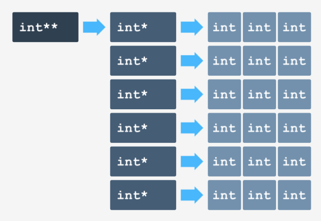
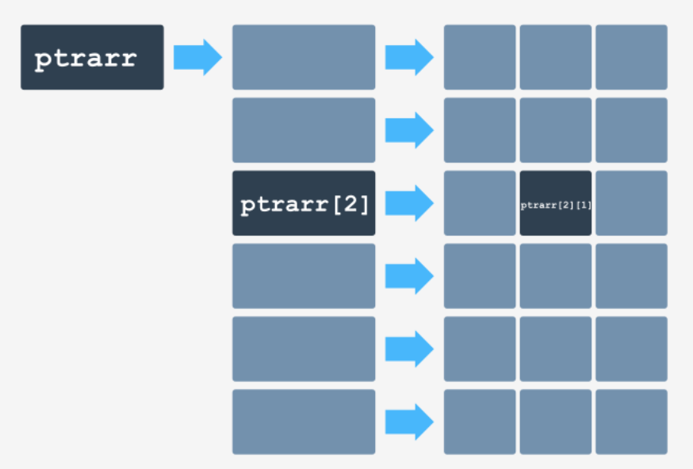

# Contenido del módulo
* [Arreglo de punteros](#arreglo-de-punteros)
* [¿Qué es una conversión?](#¿qué-es-una-conversión)
* [Strings](#strings)
* [Namespaces](#name-spaces)

# Arreglo de punteros
Nada impide que los elementos del array sean punteros. Imaginemos que necesitamos un array dinámico. El array es bidimensional y no podemos predecir cuantas filas tiene, o cuantos columnas.

Solo conocemos el número de columnas almacenada en la variable `cols` y el numero de filas en `rows`. 

Ni siquiera vamos a intentar asignar el array de la siguiente manera:

```cpp
new int[rows][cols];
```
Se observa algo razonable a primera vista, pero esto es erróneo, porque el compilador no conoce nada sobre el tamaño de las filas durante la compilación y esto no podrá generar el código de indexación correcto y el único resultado que podemos esperar de esta pieza de código es un error de compilación.

Entonces qué deberíamos hacer si queremos que nuestro array sea completamente configurable y facilmente accesible con una notación limpia y simple como la siguiente?:
```cpp
ptrarr[row_number][col_number]
```
Esto es posible y así es como lo haremos:
* Almacenamos los punteros al principio de cada fila separadamente para poder llegar a cada fila como cualquier otro vector. Estos punteros los almacenamos en el puntero, llamandolo **arreglos de punteros**; cada fila tendrá tantos elementos como columnas tenga el array deseado.
* Cada elemento en el arreglo de filas será un **puntero a una fila separada**.
* Necesitamos un puntero más que apunte al arreglo de filas - lo llamamos `ptrarr`.

Veamos la figura que ilustra la esencia de esta idea:


Cuál es el tipo de la variable `ptrarr`? 

Primero, digamos de qué tipo **no es**: con certeza podemos decir que no es un `int` (`int *`). Esto es porque el resultado de dereferenciar el `ptrarr` no es un `int` sino que es un puntero a `int`.

Esto significa que el tipo de `ptrarr` es **"un puntero a un puntero a ´int´"** que se puede escribir como `int**`. Podemos escribir una declaración de variable de este tipo como sigue:
```cpp
int **ptrarr;
```

Una vez que declaramos el puntero, podemos ubicar el arreglo de filas. Esto se hace como sigue:
```cpp
ptrarr = new int* [rows];
```
Primero el puntero retornado por `new` es de tipo `int**`(porque es un **puntero a puntero a `int`**) y es asignado a `ptrarr`.

Segundo, los elementos del array de filas serán punteros a las filas, por lo que su tipo es `int*`.

Finalmente necesitamos ubicar memoria para cada fila y almacenar el puntero resultante dentro del elemento correcto de cada arreglo de filas. Por lejos, la forma más sencilla de hacer esto es usando un loop:
```cpp
for(int r = 0; r < rows; r++) {
  ptrarr[r] = new int[columns];
}
```

Si por ejemplo queremos asignar `0` al elemento que se encuentra en la fila *r*, columna *c*, lo haremos así:
```cpp	
ptrarr[r][c] = 0;
```
¿Cómo funciona esto?
* La expresión `ptrarr[r]` es interpretada como `*(ptrarr + r)`, que significa la desreferenciación del elemento que apunta a la fila seleccionada;
* El puntero es **desreferenciado una vez más** por lo que la expresión de indexación completa tiene el siguiente aspecto:
```cpp
*(*(ptrarr + r) + c)
```
y esto es simplemente el valor deseado de tipo int.

El proceso de dereferenciación de este elemento:
```cpp
ptrarr[2][1]
```
es mostrado en la siguiente figura:


## Matrices triangulares
La ventaja de estas matrices es que cada fila puede tener una **longitud diferente**. Esto es útil para los algoritmos que no necesitan un arreglo entero para correr solo un slice del mismo. Se refiere específicamente a las matrices triangulares. Una matriz de este tipo se puede asignar de esta manera:


Veamos el siguiente código:
```cpp
#include <iostream>

using namespace std;

int main() {
  int rows = 5;

  // ubicamos e inicializmos el arreglo
  int **arr = new int* [rows];
  for(int r = 0; r < rows; r++){
      arr[r] = new int [r + 1];
      for(int c = 0; c <= r; c++){
          arr[r][c] = (r+1)*10 + c + 1;
      }
  }

  // imprimimos el arreglo
  for(int r = 0; r < rows; r++){
      for(int c = 0; c <= r; c++){
          cout << arr[r][c] << " ";
      }
      cout << endl;
  }

  // liberamos la memoria del arreglo
  for(int r = 0; r < rows; r++){
      delete [] arr[r];
  }
  delete [] arr;
}
```

Observamos como la **triangularidad** es obtenida (el tamaño del bloque de memoria ubicada depende en el número de fila) y como el valor asignado a los elementos reflejan su ubicación en el arreglo. Tengamos en mente que el orden de la liberación de la memoria es contrario al orden de ubicación.

## Conversiones implicitas
Como sabemos, las conversiones implícitas pueden producirse sin que nosotros las introduzcamos. El compilador decide donde deben ser realizadas. Por supuesto, necesitamos ser cuidadosos con esto, y necesitamos ser capaces de encontrar todas las circunstancias que pueden causar que el compilador convierta nuestros datos.

Podemos decir que las conversiones implícitas afectan nuestros datos de tipos básicos y son más frecuentemente asociadas con un cambio de **representación interna**.

Este tipo de conversión sucede cuando asignamos, por ejemplo, `int` a `float` o `float` a `long` o `double` a `int`. Hay muchas otras posibles combinaciones.

Listemos algunos contextos donde conversiones implicitas juegan un papel importante:
* Un valor es usado como parte de **una expresión compleja** construida con muchos valores de diferentes tipos. Por ejemplo:
```cpp
// Ejemplo no. 1
int Int = 1;
short Short = 2;
Int = Int + Short;
```

* Un valor juega un **papel importante de una condición lógica** con instrucciones como `if`, `while`, `for`, etc. Por ejemplo:
```cpp
// Ejemplo no. 2
double Double = 5.0;

if (Double)
  Double--;
```

* Un valor es objeto de asignación y se utiliza para:
  1. Cambiar el valor de una variable.
  2. Setear el valor de un parámetro.
  3. Especificar el valor de retorno de una función.

```cpp
int main() {
  float Float = 4.0;

  // Ejemplo no. 3
  Float = 1;

  // Ejemplo no. 4
  f(Float);			
}

// Ejemplo no. 5
float g()		 
{
return -1;
}
```


# ¿Qué es una conversión?
Una conversión es el acto de cambiar la naturaleza de los datos sin (si es posible) cambiar su valor. Uno de los ejemplos más simples de conversion es un cambio en el tipo de dato.
```cpp
long data = 1;
```
En el snippet anterior el `1` es un `int` que al ser asignado a una variable `long` se convierte a este tipo de dato.

Podemos evitar esta conversión asignando del siguiente modo:
```cpp
long data = 1L;
```

El sufijo `L` (o `l`) indica que el valor es explicitamente de tipo `long`.

Todas las conversiones posibles se dividen en 2 clases:
* **Conversiones automáticas**: que son realizadas sin nuestro conocimiento, no las necesitamos pero el compilador sabe que necesitan ser aplicadas sin nuestro permiso. Por ello es que tambien se denominan *implicitas*.
* **Conversiones explícitas**: que son realizadas en los comandos del desarrollador y expresadas  utilizando medios especiales del lenguaje C++; el compilador obedece las instrucciones del programador y realiza las conversiones de datos de acuerdo a ellas. Este tipo de conversión es usualmente llamada *typecasting* debido a su construcción sintáctica.

## Conversiones explícitas
En general, C++ nos da 3 formas de realizar conversiones explícitas:
* La autodenominada **notación funcional**, que es una convención de sintaxis nativa (actualmente obsoleta) de C++ (llamada asi por su similaridad con la notación de llamada a funciones bien conocidas). En este caso el nombre del nuevo tipo (objetivo) es tratado como una función y la conversión toma la siguiente forma:
```cpp
new_type_name (expression_old_type)
```
* La autodenominada **C-style casting**. En este caso especificamos la conversion del siguiente modo:
```cpp
(new_type_name) expression_old_type
```
* La autodenominada **static casting**, una convención nativa y actualmente reconocida y recomendada de C++ donde la conversión es realizada por un operador llamado `static_cast`; el operador toma la siguiente forma:
```cpp
static_cast<new_type_name> (expression_old_type)
```

Ambas formas son lo mismo cuando son aplicadas a variables de tipo estandar (básico) pero la notación funcional puede ademas ser usada por objetos y cuando lo hacemos, podemos tener más de un valor.

## Conversiones - ganancias y pérdidas
Siempre que sucede una conversión, el compilador realiza su mayor esfuerzo por preservar el valor original, pero esto no siempre es posible.

Un buen escenario es cuando la longitud de representación de memoria sigue siendo la misma o incrementa, en este caso podemos confiar en que el valor original será preservado.

Un ejemplo del peor escenario es cuando deseamos transferir el valor máximo permitido para `int` a una variable `short`. 

```cpp	
#include <iostream>

using namespace std;

int main() 
{
int i = 2147483647;
short s = i;

if (i == s)
  cout << "equal" << endl;
else
  cout << "not equal" << endl;
}
```

Desgraciadamente, esta historia no terminará felizmente. Como los enteros cortos suelen utilizar dos veces menos bits que los enteros normales, algunos bits superiores de la variable `i` se perderán irremediablemente durante la conversión implícita. No podemos salvarlos. Que descansen en paz atrapados en algún lugar del espacio de direcciones.

La salida es:
```
not equal
```

Para el caso de conversión de `float` a `double` no tendremos este problema:
```cpp
#include <iostream>

using namespace std;

int main()
{
float f = 1234.5678;
double d = f;

if (d == f)
  cout << "equal" << endl;
else
  cout << "not equal" << endl;
}
```
La salida será:
```
equal
```


Como antes, hemos invertido el sentido de la conversión, pero aquí el rango no es un problema. El valor que se convierte es lo suficientemente pequeño como para ser almacenado en cualquier variable flotante. El problema aquí es la precisión.

Los `float` no pueden almacenar tantos dígitos significativos como los especificados en el literal asignado a la variable d.

No perderemos ningún valor. ¿Significa esto que sufriremos una pérdida de precisión?

Desgraciadamente, sí. El código muestra "no igual" en la pantalla.

```cpp
#include <iostream>

using namespace std;

int main() 
{
double d = 123456.789012;
float f = d;

if (d == f)
  cout << "equal" << endl;
else
  cout << "not equal" << endl;
}
```
La respuesta será:
```
not equal
```

Las conversiones de tipos de punto flotante a tipos integrales siempre causan una pérdida de precisión. Siempre perdemos la parte fraccionaria de un número flotante.

Cuando el `float` es extremadamente grande (o extremadamente pequeño) también experimentarás una pérdida de valor. Esto se aplica a los valores más allá del alcance del tipo integral objetivo.

```cpp
#include <iostream>

using namespace std;

int main() 
{
float f = 123.456;
float g = 1e100;
int i = f;
int j = g;

cout << i << endl;
cout << j << endl;
}
```

La salida será:
```
123
-2147483648
```

Para evitar ambos tipos de problemas el compilador usa una estrategia llamada **promotion**. Un **promotion** involucra la conversion de datos participando en una evaluación del tipo más seguro. 

Por ejemplo, cuando un `int` y un `short` son usados en la misma expresión podemos esperar que el valor de menor rango (`short`) sea promocionado al tipo con el mayor rango (`int`) y asi no tendremos ninguna pérdida de valor.

# Strings
Una declaración simple de strings en C++ es:
```cpp
#include <string>

string pet_name;
```

> Una aclaración importante, la palabra `string` no es una keyword, como `int` o `float`.

Los strings se inicializan del mismo modo que otros tipos de datos:
```cpp
string pet_name = "Fido";
```

Solo hay que tener en cuenta que el literal a asignarle a la variable debe estar **entre comillas dobles**, las comillas simples son solo para caracteres.

Hay otro modo de inicializar variables strings, más adecuado para el estilo de la programación orientada a objetos:
```cpp
string pet_name("Fido");
```

**No usamos el operador de asignación**.

Ambas formas de inicialización son lo mismo, sus resultados son exactamente iguales. 

## Operadores de Strings: `+`
Al igual que otros tipos de datos, **los strings tienen sus propios operadores**. Uno de los más importantes es es frecuentemente usado `+ `. Este operador concatena los strings.

```cpp
#include <iostream>
#include <string>

using namespace std;

int main() 
{
string good = "Jekyll", bad = "Hyde";

cout << good + " & " + bad << endl;
cout << bad + " & " + good << endl;
}
```

La salida será:
```
Jekyll & Hyde
Hyde & Jekyll
```

Este operador tiene una limitación importante: **no puede contatenar literales**. Puede conctatenar cualquier variable con un literal, un literal con una variable y obviamente dos variables, pero concatenar literales es algo que el operador nunca hará.

El siguiente programa tiene un **error**:
```cpp
#include  <iostream>
#include  <string>

using namespace std;

int main() 
{
string s;

s = "A" + "B";
s = s + "C";
s = "B" + s;
cout << s << endl;
}
```
```
main.cpp: In function ‘int main()’:
main.cpp:10:13: error: invalid operands of types ‘const char [2]’ and ‘const char [2]’ to binary ‘operator+’
  s = "A" + "B";
```

Este error justamente se debe al intento de concatenación de dos literales en la linea `s = "A" + "B";`.

## Introducción de Strings
Introducir strings es un poco más complicado que imprimirlos, debido al hecho de que el stream `cin` trata a los espacios como delimitadores, demarcando limites entre los datos. Esto significa que podríamos complicarnos si buscamos introducir y almacenar un string que contiene espacios (caracteres blancos).

Si ejecutamos el siguiente código, intentando introducir la cadena `To be or not to be`:
```cpp
#include <iostream>
#include <string>

using namespace std;

int main() 
{
string line_of_types;

cin >> line_of_types;
cout << line_of_types << endl;
}
```
La salida del mismo, es decir, el contenido de la variable `line_of_types` será `To`.

Si deseamos introducir una linea de texto completa y tratar los caracteres blancos como cualquier otro tipo de caracter, debemos usar la función `getline()`. Esta función lee todos los caracteres introducidos hasta el caracter de fin de línea. Como resultado, todos los caracteres ingresados antes de presionar la tecla `Enter` serán almacenados en un string.

Ahora veamos como queda el programa anterior modificado, ingresando la cadena *To be or not to be*:
```cpp
#include <iostream>
#include <string>

using namespace std;

int main() 
{
string line_of_types;

getline(cin, line_of_types);
cout << line_of_types << endl;
}
```
La salida será:
```
To be or not to be
```

## Comparando strings
Si deseamos comprobar si dos strings contienen la misma cadena de caracteres podemos usar el operador `==`-:
```cpp
#include <iostream>
#include <string>

using namespace std;

int main() {
string secret = "abracadabra";
string password;

cout << "Enter password:" << endl;
getline(cin, password);
if (secret == password)
  cout << "Access granted" << endl;
else
  cout << "Sorry";
}
```

Obviamente podemos comparar dos strings de forma más flexible. Todos los operadores diseñados para comparar datos están a nuestra disposición: `!=`, `>`, `<`, `>=`, `<=`.  Podemos comprobar si una de las cadenas es mayor/menor que la otra, pero estas comparaciones se realizan en orden alfabético donde 'a' es mayor que 'A' y obviamente 'z' es mayor que 'a', pero 'a' es mayor que '1'.

Este tipo de comparaciones lo podemos usar para determinar el orden alfabético de dos o más strings.

El siguiente snippet de código compara dos strings ingresados por el usuario y determina cual es el mayor:
```cpp
#include <iostream>
#include <string>

using namespace std;

int main() 
{
string str1, str2;

cout << "Enter 2 lines of text:" << endl;
getline(cin, str1);
getline(cin, str2);
cout << "You've entered:'" << endl;
if (str1 == str2)
  cout << "\"" << str1 << "\" == \"" << str2 << "\"" << endl;
else if (str1 > str2)
  cout << "\"" << str1 << "\" > \"" << str2 << "\"" << endl;
else
  cout << "\"" << str2 << "\" > \"" << str1 << "\"" << endl;
}
```

## Comparando strings - el enfoque orientado a objetos
Los Strings ofrecen otro método más complejo pero más potente de comparación. Podemos hacer uso de este si tenemos algun conocimiento de cómo los objetos manipulan sus datos. 

El método utilizado se denomina `compare` y retorna un `0` en caso de que los strings sean idénticos:
```cpp
if(secret.compare(password) == 0) cout << "Access granted" << endl;
```

Podemos escribir esta expresión de la siguiente manera:
```cpp
password.compare(secret)
```
Sin cambiar el comportamiento del programa.

Veamos el snippet de código completo:
```cpp
#include <iostream>
#include <string>

using namespace std;

int main() 
{
string secret = "abracadabra";
string password;

cout << "Enter password:" << endl;
getline(cin, password);
if (secret.compare(password) == 0)
  cout << "Access granted" << endl;
else
  cout << "Sorry";
}
```

Por supuesto, las posibilidades de comparar los miembros de una función no terminan al comprobar la igualdad de dos strings. La función puede ademas diagnosticar todas las posibles relaciones entre dos strings. Así es como funcinoa:

* `str1.compare(str2) == 0` cuando `str1 == str2`
* `str1.compare(str2) > 0` cuando `str1 > str2`
* `str1.compare(str2) < 0` cuando `str1 < str2`

```cpp
#include <iostream>
#include <string>

using namespace std;

int main() 
{
string str1, str2;

cout << "Enter 2 lines of text:" << endl;
getline(cin, str1);                                           // Se obtiene el primer string
getline(cin, str2);                                           // Se obtiene el segundo string
cout << "You've entered:'" << endl;
if (str1.compare(str2) == 0)                                  // Se efectua la comparación de los strings (POO)
  cout << "\"" << str1 << "\" == \"" << str2 << "\"" << endl; // Se imprime el resultado si son iguales
else if (str1.compare(str2) > 0)
  cout << "\"" << str1 << "\" > \"" << str2 << "\"" << endl;  // Se imprime el resultado si el primero es mayor
else
  cout << "\"" << str2 << "\" < \"" << str1 << "\"" << endl; // Se imprime el resultado si el segundo es mayor
}
```

## Substrings
Los strings pueden ser procesados de forma más precisa cuando solo ciertas partes de ellos son tomadas en cuenta. Una parte de un string se denomina *substring*.

Si desamos crear un nuevo string que consista de caracteres tomados de otro (o el mismo) string podemos usar una función  llamada `substr`, un prototipo simplificado e informal se ve como a continuación:
```cpp
newstr = oldstr.substr(posicion_de_inicio_del_substring, longitud_del_substring);
```
El substring de cualquier string se define por dos *"coordenadas"*:
* El lugar donde el substring empieza
* Su longitud

Ambos parámetros tienen valores por defecto, lo cual permite usar la función en una forma más flexible:
* `s.substr(1,2)`: describe un substring del string `s` que comienza en el segundo caracter y termina en el tercero (inclusivo).
* `s.substr(1)`: describe un substring que comienza en el segundo caracter del string `s` y contiene todos los caracteres restantes del mismo, incluyendo el último, al omitir la longitud del substring el parametro por defecto cubre todos los caracteres restantes.
* `s.substr()` es solo una copia del string `s` completo.

Por ejemplo, el siguiente código:
```cpp
#include <iostream>
#include <string>

using namespace std;

int main() 
{
string str1 = "ABCDEF";
string str2 = str1.substr(1, 1) + str1.substr(4) + str1.substr();
//                    "B"       +       "EF"     + "ABCDEF"

cout << str2 << endl;
}
```

Imprime:
```
BEFABCDEF
```

## Longitud de un string
Esta información es dada por dos funciones gemelas. Sus nombres son diferentes, pero sus comportamientos idénticos. Podemos decir que estas funciones son *sinónimos*.

Sus prototipos informales se ven como a continuación:
```cpp
int string_size = any_string.size();
int string_size = any_string.length();
```

Ambas funciones retornan un valor equivalente al numero de caracteres almacenados actualmente en un string.

## Comparación más detallada de strings
Las funciones de comparación no solo permiten comparar strings, sino que tambien substrings. Sus prototipo es el siguiente:
```cpp
any_string.compare(posicion_de_inicio_del_substring, longitud_del_substring, otro_string);
any_string.compare(posicion_de_inicio_del_substring, longitud_del_substring, otro_string, otro_string_inicio, otro_string_longitud);
```

Comenzamos con el caso más simple. Esta variante de la función de comparación compara el string externo completo con el substring del string fuente. Esto significa que el siguiente snippet dará cero (los strings son iguales):
```cpp
string s = "ABC";

cout << s.compare(1,1,"B");
```

La segunda variante nos permite usar solo una parte del string externo. De forma similar, el siguiente snippet de código dará cero:
```cpp
string s = "ABC";

cout << s.compare(1, 1, "ABC", 1, 1);
```

## Buscando Strings dentro de Strings
Podemos buscar un substring o un simple caracter usando una de las variantes de la función `find`. Estos dos son particularmente útiles:
```cpp
int donde_inicia = cualquier_string.find(otro_string, posicion_de_inicio);

int donde_esta = cualquier_string.find(cualquier_caracter, posicion_de_inicio);
```

En ambas variantes, el valor por defecto de `posicion_de_inicio` es `0`, por lo que podemos omitirlo para buscar desde el inicio del string.

El resultado retornado por las funciones apuntan a la primera ubicación del string donde el string buscado comienza o donde el caracter buscado está ubicado. Si la búsqueda falla, ambas funciones retornan un valor especial `string::npos`. Podemos usar este valor para comprobar si nuestro string contiene el string buscado o no.

Un ejemplo sencillo es el siguiente:
```cpp
#include <iostream>
#include <string>

using namespace std;

int main() 
{
string greeting = "My name is Bond, James Bond.";
string we_need_him = "James";

if (greeting.find(we_need_him) != string::npos)
  cout << "OMG! He's here!" << endl;
else
  cout << "It's not him." << endl;

int comma = greeting.find(',');
if (comma != string::npos)
  cout << "Interesting. He used a comma." << endl;
}
```
Que da como resultado:
```	
OMG! He's here!
Interesting. He used a comma.
```

## ¿Qué tan grande es el string actualmente?
Las funciones para obtener la longitud del string solo nos dicen cuantos caracteres tiene actualmente almacenados el string, pero no dice nada sobre la memoria ocupada por los buffers ubicados en este. Por supuesto, el tamaño del buffer será mayor que el string en si mismo, si queremos que la máquina funcione eficazmente.

Cada vez que extendemos un string, por ejemplo concatenandolo con otro, el nuevo contenido es ubicado en buffers. Si los buffers son lo suficientemente grandes, la extensión del string no requerirá que los mismos se extiendan. Por supuesto, cuando los buffers están llenos y el string está siendo extendido nuevamente, el buffer es reubicado para ajustarse al nuevo contenido. Este proceso es totalmente transparente y en muchos casos, no necesitamos saber nada sobre el mismo.

Obviamente, si lo deseamos, podemos controlar el proceso cuando conocemos la naturaleza de un string en particular y su propósito. Los strings ofrecen algunas formas de comprobar como los buffers están trabajando y reconocer la condición del string.

Por ejemplo, podemos consultar a cualquier string por el tamaño de sus bufers actualmente asignados. La respuesta viene dado por la funcion llamada `capacity`. La podemos usar del siguiente modo:
```cpp
int actualmente_usado = cualquier_string.capacity();
```
El resultado de esta función es siempre igual o mayor al tamaño/longitud del string.

Todo string puede crecer, pero hay un límite a estas extensiones y en este caso, el limite es un valor definido para todos los strings en la implementación. Podemos encontrar esta valor usando la función `max_size()`. Podemos esperar que este valor es grande, mucho más grande de lo que probablemente necesitemos en programas típicos. Aquí hay un ejemplo de como usar esta función:
```cpp
int no_mayor_a = any_string.max_size();
```

Al intentar crear un string con una capacidad mayor a la máxima obtenemos un mensaje como el siguiente:
```
terminate called after throwing an instance of 'std::bad_alloc'
what():  std::bad_alloc
line 1:  1014 Aborted                 (core dumped) 
```

## ¿Cómo podemos controlar el tamaño de un string?
Podemos controlar el tamaño de memoria que usa un string con la función `reserve()`. Esta puede funcionar en ambas direcciones con la misma facilidad, es decir, puede tanto retraer como expandir los buffers. La función requiere un parámetro de tipo `int` para especificar el tamaño deseado de los buffers asignados. 

Un punto importante es que el contenido del string no es cambiado de ninguna manera, podemos decir que es **inmune** a los efectos de la función `reserve()`.

La función, sin embargo, puede no ser tan estricta a la hora de determinar el tamaño final de la memoria asignada. Puede redondear el valor del parámetro para ajustarlo a las necesidades actuales de memoria y/o a las condiciones de la plataforma de destino.

El siguiente ejemplo muestra qué podemos esperar de esta función. Se observa que el contenido del string no es afectado en cada caso:
```cpp
#include <iostream>
#include <string>

using namespace std;

void print_info(string& s) {
cout << "content = \"" << s << "\"";
cout << "capacity = " << s.capacity() << "\"";
cout << "--------" << endl;
}

int main() {
string the_string = "content";

pring_info(the_string);
the_string.reserve(100);
print_info(the_string);
the_string.reserve(0);
print_info(the_string);
}
```
El resultado de este programa es:
```
content ="content" capacity = 15
---------
content ="content" capacity = 100
---------
content ="content" capacity = 15
---------
```

## ¿Cómo controlamos el contenido de un string?
Podemos controlar la longitud del contenido del string de varias formas. Las funciones que veremos podrían además cambiar la ubicación de memoria, este es un posible efecto secundario.

Primero que nada, podemos vaciar el string  **eliminando todos los caracteres almacenados en él**. Esto es equivalente a asignar un string vacío al string, pero esto podría ser un poco más rápido. El vaciado de un string es realizado por la función `clear()`, que no requiere parámetros.

Cambiar el tamaño del string es llevado a cabo por la función llamada `resize()`. Su variante básica requiere un parámetro de tipo `int` especificando el tamaño nuevo deseado del string. Si el parámetro es menor al tamaño actual del string, este será **truncado**.

Si el parámetro es mayor que el tamaño del string, el mismo será expandido. Podemos usar una funcion sobrecargada de la función permitiendo especificar el carácter que se utilizará para rellenar el nuevo espacio asignado (el caracter *null* `\0` es el valor por defecto).

Podemos además comprobar si un string particular está vacío comparandolo con un string vacío. Podemos lograr el mismo efecto con una función de forma más efectiva. El nombre de la función es `empty()`, no requiere parámetros y retorna un booleano que indica si la verdad de la siguiente oración: *el string está vacío*.

El siguiente ejemplo es una muestra simple de como usar estas 3 funciones:
```cpp
#include <iostream>
#include <string>

using namespace std;

void print_info(string& s) {
cout << "content = \"" << s << "\"";
cout << "is empty? " << (s.empty()? "Yes": "No") << "\"";
cout << "--------" << endl;
}

int main() 
{
string the_string = "content";

print_info(the_string);
the_string.resize(50, '?');
print_info(the_string);
the_string.resize(4);
print_info(the_string);
the_string.clear();
print_info(the_string);
}
```

## Appending strings
Una de las funciones para agregar contenido o concatenar strings es `append()`. Esta tarea puede ser realizada por el operador `+=`, sin embargo la función `append` es más flexible y útil ya que puede darnos más opciones:
* Unir strings:
```cpp
string str1 = "content", str2 = "appendix";
str1.append(str2); // str1 = "contentappendix"
```
* Unir string con un substring:
```cpp
string str1 = "content";
st1.append("tail", 1, 3); // str1 = "contentail"
```
* Unir un string y un caracter (pudiendo repetirlo `n` veces):
```cpp
string str1 = "content";
str1.append(3,  'x'); // str1 = "contentxxx"
```

Todas estas variables no solo afectan el contenido del string sino que también retornan el string modificado como resultado. Podríamos hacer uso de este efecto construyendo un cadena de invocaciones a `append()`.

## Appending characters
Si deseamos unir solo un caracter a un string podemos usar la función `append` pero hay una forma más eficiente de hacerlo usando la función `push_back`.

El siguiente snippet de código muestra como usar estas funciones:
```cpp
#include <iostream>

#include <string>

using namespace std;

int main(void) {
string the_string;
for (char c = 'A'; c <= 'Z'; c++)
  the_string.push_back(c);
cout << the_string << endl;
return 0;
}
```
Cuyo resultado es:

```
ABCDEFGHIJKLMNOPQRSTUVWXYZ
```

## Insertando un substring o un caracter
El siguiente snippet es un ejemplo claro de cómo usar la función `insert`:
```cpp
string quote = "to be ";
quote.append("quote");
quote.insert(6, "or not ");
cout << quote << endl;
```
El primer parámetro especifica **dónde** se realizará la inserción mientras que el segundo indica qué es lo que se insertará. Esta es una de las opciones que da esta función, tambien permite insertar substring:
```cpp
#include <iostream>
#include <string>

using namespace std;

int main() 
{
string quote = "Whyserious?", anyword = "monsoon";

quote.insert(3, 2, ' ').insert(4, anyword, 3, 2);
cout << quote << endl;
}
```
Este snippet inserta primero dos espacios en el tercer caracter. Luego inserta un substring de "anyword" igual a **"so"** en el cuarto caracter.

El resultado de este programa es:
```
Why so serious?
```

## Asignando un substring o caracter
La función `assign` es muy similar a `insert` pero **no retiene** el contenido previo del string, en su lugar **lo reemplaza con uno nuevo**. La función `assign()` es tan universal como las funciones `insert()` o `append()`, por lo que es más conveniente en algunas aplicaciones específicas.

```cpp
#include <iostream>
#include <string>

using namespace std;

int main() 
{
string sky;

sky.assign(80, '*');
cout << sky << endl;
}
```

## Reemplazando un substring
La función `replace()` permite reemplazar una parte del string con otro string o substring.

La función necesita saber qué parte del string será reemplazada y debemos especificarlo dando dos numeros:
1. El primer describe la posición de inicio.
2. El segundo dice la cantidad de caracteres a ser reemplazados.

El siguiente ejemplo muestra como reemplazar un substring con otro substring:
```cpp
#include <iostream>
#include <string>

using namespace std;

int main() 
{
string to_do = "I'll think about that in one hour";
string schedule = "today yesterday tomorrow";

to_do.replace(22, 12, schedule, 16, 8);
cout << to_do << endl;
}
```

## Eliminando un substring
Podemos eliminar una parte de un string haciendolo más corto, usando la función `erase()` la cual requiere dos números para realizar su tarea:
1. El lugar donde el substring a eliminar comienza
2. La longitud del substring

Esto significa que una invocación como la siguiente:
```cpp
the_string.erase();
```
Elimina todos los caracteres del string, dejandolo vacío.

El siguiente snippet de código:
```cpp
#include <iostream>
#include <string>

using namespace std;

int main() 
{
string where_are_we = "I've got a feeling we're not in Kansas anymore";

where_are_we.erase(38, 8).erase(25, 4);
cout << where_are_we << endl;
}
```
Produce la siguiente salida:
```
I've got a feeling we're in Kansas
```

## Cambiando el contenido de dos strings
Cuando lidiamos con tareas de ordenamiento posiblemente necesitemos intercambiar el contenido de dos strings, o unidades de un arreglo. Para ello necesitamos de una variable auxiliar donde se almacenará temporalmente una de las variables. Por desgracia esto no es para nada eficiente cuando trabajamos con strings. Sería mucho más simple y rápido no transferir el contenido de los strings sino reemplazar los identificadores de sus punteros. Esta acción es realizada llamando a la función `swap()`. La siguiente función muestra como usar esta función:
```cpp
#include <iostream>
#include <string>

using namespace std;

int main() 
{
string drink = "A martini";
string needs = "Shaken, not stirred";

cout << drink << ". " << needs << "." << endl;
drink.swap(needs);
cout << drink << ". " << needs << "." << endl;
}
```

Este snippet da la siguiente salida:
```
A martini. Shaken, not stirred.
Shaken, not stirred. A martini.
```

# Name spaces
El name space es un espacio en que un nombre particular tiene un significado inequívoco y claro. Por ejemplo, en nuestra familia más cercana hay un espacio de nombres (name space) en el que nuestro nombre dado nos identifica a nosotros y (muy probablemente) solo a nosotros. Cuando dejamos nuestro espacio de nombres hogareño, nuestro nombre dado deja de ser claro. En grandes comunidades está la posibilidad de que nos encontremos con otras personas con el mismo nombre y esto haría que si alguien en público grita nuestro nombre, varias personas giren sus cabezas en la dirección de la voz.

¿Hay algún método de hacer que nuestro nombre sea más explicito? Por supuesto. Nuestro nombre debe ser clasificado con otro nombre con la esperanza de que este nuevo grupo verbal será más especifico en el nuevo espacio más amplio. Esto es lo que conocemos como nuestro apellido.

Por supuesto, es muy posible que este tipo de clasificación no sea suficiente, con lo cual hay diferentes formas de formar name space. Otros ejemplos comunes de name spaces en la vida real pueden ser las patentes de los autos, los dominios de internet, etc.

El siguiente snippet de código genera un error debido a los name spaces:
```cpp
#include <iostream>

int main() 
{
cout << "Play it, Sam" << endl;
}
```

El error generado es:
```
main.cpp:5:3: error: ‘cout’ was not declared in this scope
  cout << "Play it, Sam" << endl;
```

La línea faltante es la siguiente:
```cpp
using namespace std;
```

El compilador estará totalmente desorientado si intentamos forzarlo a usar nombre sin definir el name space al que estos pertenecen (`cout` y `endl`).

La clasificación de estos nombres para relacionarlos con su name espace debe hacerse usando una sintaxis especial, la cual se ve así:
```cpp
home_name_space :: entity_name
```

> El namespace para ambas entities es llamado `std` (standard).

Una forma de realizar este mismo programa sin utilizar la linea de código `using namespace std;` es la siguiente:
```cpp
#include <iostream>

int main() 
{
std::cout << "Play it, Sam" << std::endl;
}
```

El operador `::` se denomina "scope resolution operator" y no solo es usado para especificar el name space al que pertenece un nombre.

Finalmente, utilizando la linea de código `using namespace std;` el programa se vería así:
```cpp
#include <iostream>

using namespace std;

int main() 
{
cout << "Play it, Sam" << endl;
}
```

## Definir un namespace
Un Troll puede ser una criatura sacada de un cuento o una persona realizando maldades en internet. Vamos a crear dos diferentes name spaces y vamos a vincular los trolls a sus origenes. La definición de un namespace tiene un aspecto como el siguiente:
```cpp
namespace name_space_name
{
// code
}
```

Cualquier entidad declarada dentro de un namespace se vinculará a este namespace y por lo tanto, logicamente separada de otra con el mismo nombre.

En el siguiente ejemplo definimos dos namespaces y ubicamos un troll dentro de cada uno de ellos. Si queremos usarlos, debemos calificar sus nombres con el nombre del home spacename:
```cpp
#include <iostream>

using nampespace std;

namespace Hogwarts {
int troll = 1;
}

namespace Mordor {
int troll = 2;
}

int main () {
cout << Hogwarts::troll << " " << Mordor::troll << endl;
}
```

## Usando un namespace
Si cualquiera de los namespaces disponibles es más usable o preferible debería ser usado de foprma que sugiera al compilador que intente clasificar cada nombre inclasificado con este/estos nombres de spacenames.

El hecho de **usar un namespace seleccionado** es traido por la sentencia `using namespace`. Si la sentencia se encuentra fuera de todo bloque afectará al código posterior hasta el final del archivo.

El siguiente ejemplo muestra un caso donde dos sentencias `using namespaces` han sido especificados en el mismo código. El primero nos permite usar los identificadore `cout` y `endl`. El último declara que cualquier "troll" no clasificado corresponde al namespace `Hogwarts`:

```cpp
#include <iostream>

using namespace std;

namespace Hogwarts {
int troll = 1;
}

namespace Mordor {
int troll = 2;
}

using namespace Hogwarts;

int main () {
cout << troll << " " << Mordor::troll << endl;
}
```

Si la sentencia `using namespace` es situada dentro de un bloque, su alcance termina en el mismo lugar en que el bloque termina. Podemos usar este efecto para hacer un uso selectivo de los namespaces disponibles.

En el siguiente ejemplo usamos los 3 namespaces disponibles del siguiente modo:
* El namespace `std` usado globalmente.
* Los namespaces `Hogwarts` y `Mordor` usados selectivamente.

```cpp
#include <iostream>

using namespace std;

nameaspace Hogwarts {
int troll = 1;
}

namespace Mordor {
int troll = 2;
}

int main () {
{
  using namespace Hogwarts;
  cout << troll << " ";
}
{
  using namespace Mordor;
  cout << troll << endl;
}
}
```

## Expandiendo un namespace
El siguiente ejemplo muestra como extender cualquier namespace definido anteriormente. Como podemos ver, hemos construido un código que contiene definiciones dobles de nuestros dos namespaces. Sin embargo nuestros namespaces no están duplicados, están extendidos.
```cpp
#include <iostream>

using namespace std;

namespace Hogwarts {
int troll = 1;
}
namespace Mordor {
int troll = 2;
}
namespace Hogwarts {
float wizard = -0.5;
}
namespace Mordor {
float wizard = 0.5;
}

int main () {
cout << Hogwarts::troll << " " << Hogwarts::wizard << endl;
cout << Mordor::troll << " " << Mordor::wizard << endl;
}
```

Asumimos que todas las definiciones de los namespaces que usan el mismo identificador están "pegadas" y construyen un solo y gran namespace. Además cada extensión podría ser ubicada dentro de un archivo separado, lo cual significa que cualquiera de estos namespaces puede estár dispersado en varios archivos creados por diferentes desarrolladores.

La primer aparición de un namespace es llamada "un namespace original". Cualquier namespace con el mismo identificador que aparezca luego del original es llamado "una extension del namespace".

## Usando una entidad
La sentencia `using` hace uso de todo el namespace, es decir, simplemente clasifica todas las entidades vinculadas al space. Existe otra sentencia que nos permite decidir de forma selectiva qué entidades serán uisadas y cuales permanecerán ocultas en el space. Pero existe una importante condición: ninguna de las sentencias usadas debe causar ambigüedad en el proceso de identificar todas las entidades usadas en el código.

El siguiente ejemplo muestra un código que emplea la sentencia `using` para seleccionar dos criaturas diferentes de dos mundos diferentes. En efecto, su uso es más sencillo sin comprometer la unicuidad y claridad:
```cpp
#include <iostream>

using namespace std;

namespace Hogwarts {
int Troll = 1;
float Wizard = -0.5;
}
namespace Mordor {
int Troll = 2;
float wizard = 0.5;
}

using Mordor::Troll;
using Hogwarts::Wizard;

int main () {
cout << Hogwarts::Troll << " " << Wizard << endl;
cout << Troll << " " << Mordor::wizard << endl;
}
```
## Un namespace sin nombre
Existe una alternativa interesante en la definición del namespace. Podemos definir un namespace sin un nombre (anónimo).

Este tipo de namespace es implicita y automáticamente usado en un archivo fuente donde su definición es visible. Es otra forma de introducir entidades accesibles a traves de todo el archivo fuente.

El siguiente ejemplo muestra dos namespaces: uno anónimo y uno creado con nombre. Todas las entidades definidas dentro del spacename anónimo puede ser accedidas sin otra preparación:
```cpp
#include <iostream>

using namespace std;

namespace {
int troll = 1;
float wizard = -0.5;
}
namespace Mordor {
int troll = 2;
float wizard = 0.5;
}

int main () {
cout << troll << " " << wizard << endl;
cout << Mordor::troll << " " << Mordor::wizard << endl;
}
```

## Renombrando un namespace
Puede suceder que un namespace que tenemos o deseamos usar utilice un nombre inconveniente. Podemos renombrarlo localmente, es decir, podemos usar un nombre diferente para el namespace en el código fuente donde el acto de renombramiento fue efectuado.

Podemos usar esto con una sentencia de spacename nueva:
```cpp
namespace new_name = old_name;
```

El nuevo nombre del namespace puede ser usado con el antiguo. Esto significa que el renombramiento es solapado si los dos nombres son válido.

El siguiente ejemplo muestra cómo un nombre largo y retorcido podría ser solapado para hacer la vida del desarrollador un poco más fácil:
```cpp
#include <iostream>

using namespace std;

namespace what_a_wonderful_place_for_a_young_sorcerer {
int troll = 1;
float wizard = -0.5;
}
namespace Mordor {
int troll = 2;
float wizard = 0.5;
}

namespace Hogwarts = what_a_wonderful_place_for_a_young_sorcerer;

int main () {
cout << Hogwarts::troll << " " <<
  what_a_wonderful_place_for_a_young_sorcerer::wizard << endl;
cout << Mordor::troll << " " << Mordor::wizard << endl;
}
```